# Skafferiet Restaurant

Skafferiet is a local (not real) restaurant, based in central Stockholm, Sweden. 

*At Skafferiet we serve our interpretation of modern bistro fare, hearty and uncomplicated dishes, many of which are for sharing by two or more. Skafferiet is a natural rendezvous with a mixed crowd, a friendly restaurant you can frequent visit.*

The restaurants website targets curious people seeking to enjoy modern cuisine presented in a fun and simple but elegant manner in an vibrant environment. 

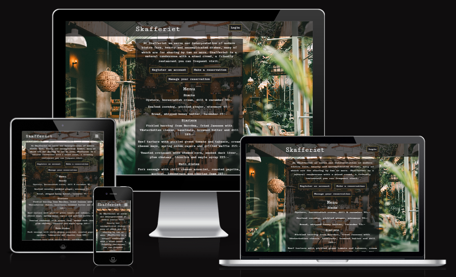

# Table of contents
1. [UX-Design](#ux-design)
    - [Planning](#planning)
        - [Design Thinking](#design-thinking)
        - [User Stories](#user-stories)
        - [Website flow](#website-flow)
    - [Wireframe](#wireframe)
        - [Style and colors](#style-and-colors)
2. [Database Model](#database-model)
    - [ERD](#erd)
3. [Features](#features)
    - [Existing Features](#existing-features)
4. [Technologies Used](#technologies-used)
    - [Languages](#languages)
    - [Frameworks, Libraries and Programs](#frameworks-libraries-and-programs)
    - [Tools](#tools)
5. [Manual Testing](#manual-testing)
    - [Bugs](#bugs)
6. [Deployment](#deployment)
7. [Future Improvements](#future-improvements)
8. [References](#references)
    - [Code Content](#code-content)
    - [Media](#media)
    - [Design Tools](#design-tools)
    - [Acknowledgements](#acknowledgements)

# UX-Design
## Planning
### Design thinking
When I began working on this project I tried to put myself in the users position, trying to imagine what a users wants and needs are in a website for a restaurant. 

I first posed two important questions imagined being answered by both a user of the website and guest of the restaurant: 
- Why would a user want to visit our restaurants website?
    - *To discover the restaurant, view the menu, book a reservation, find contact and opening hours information.*
- What will make them return?
    - *A pleasant experience of both the physical restaurant and websites pleasant UX (i.e. clear navigation, easy to book/manage reservation).*

Examining the answers of these questions, I could follow up with a final question, also imagined being answered by a user: 
- What do I want to see when I visit a restaurants website?
    - *Restaurant name, contact info, opening hours, booking functionality and menu.*

By posing these three important questions, I could now base my user stories on the answers.

### User stories
Below are the user stories in their epics created for this project. 

As a site user: 

- Navigation
    - View site navigation:
        - As a **Site user** I can **view options to make a new reservation or manage an existing reservation** so that **I can choose where to navigate to on the website** 
- Create a reservation
    - Create reservation: 
        - As a **logged in Site user** I can **create a reservation** so that **I have a reserved time and date at the restaurant** 
    - Party number: 
        - As a **Site user** I can **view the options for the number of people to reserve for** so that **I can select the amount of people in my party**
    - Enter date:
        - As a **Site user** I can **enter a date** so that **I can select which date to make a reservation** 
    - Available times:
        - As a **Site user** I can **view a list of available times on available dates** so that **I can select what time to make a reservation** 
    - Add name and email:
        - As a **Site user** I can **register a first name, last name and an email address** so that **I can make a reservation** 
- Authentication and managing a reservation 
    - Register account:
        - As a **Site user** I can **register an account** so that **I can create a reservation**
    - View reservations: 
        - As a **logged in Site user** I can **view a list of my reservations** so that **I can decide which reservation to manage** 
    - Manage reservation:
        - As a **Site user** I can **enter user details** so that **I can create a reservation or read, update or delete my existing reservation** 
- Additional information
    - View menu:
        - As a **Site user** I can **view the restaurant’s menu** so that **I know what they are currently offering
    - View contact information:
        - As a **Site user** I can **view contact information and the opening hours** so that **I know where the restaurant is and when it is open**
    - View social media:
        - As a **Site user** I can **view social media links** so that **I can open external links to the restaurant’s social media accounts**

As a site admin: 
- Authentication and managing a reservation
    - Manage guest reservation:
        - As a **Site admin** I can **create, read, update and delete guest reservations** so that **I can manage guest reservations** 

### Website flow
With the user stories in place I could begin to imagine how a user would interpret the flow of the website: 

-	User visits website
    - User is presented with a one-page website containing:
        - Logo
        - **Reservation button**
        - **Manage your reservation button**
        - Menu 
        - Open hours
        - Contact info
        - Social media links
        - A relevant image/color/something in the background

-	The **Reservation button** takes the user to a page with a booking system where they are presented with entry fields to fill:
    - An experience (dinner) 
    - Guest number
    - Date
    - Time
    - (Optional message)
        - After choosing Experience/Guest/Date/Time, user is required to enter name, last name, email address
-	The **Manage your reservation button** takes the user to a page with where they are asked to enter user details. The user enters their details and they are presented with the options to edit their booking. 

## Wireframe
Before building, when planning this website I used the design tool Figma, to create a wireframe of the project. It allowed me to make a basic sketch of what I wanted the the website to look like, what features to include and where to place them. This proved to be very useful as I could base my decisions on the already sketched out wireframe when building the website.

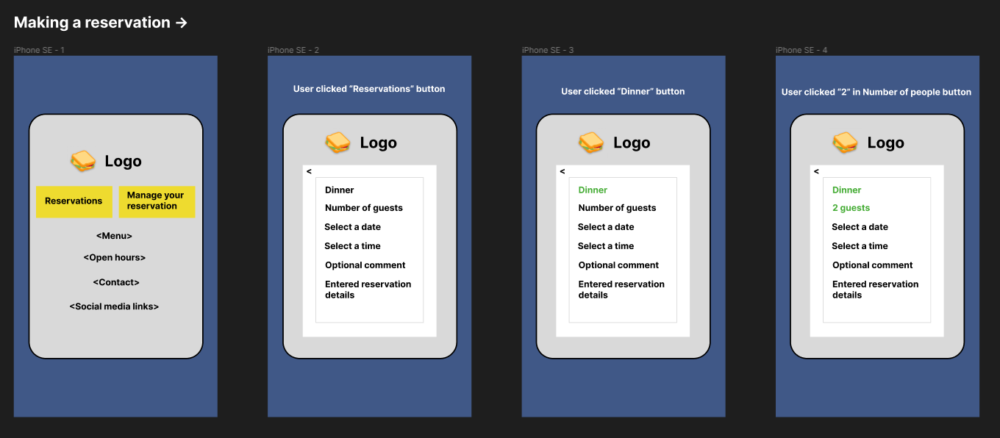
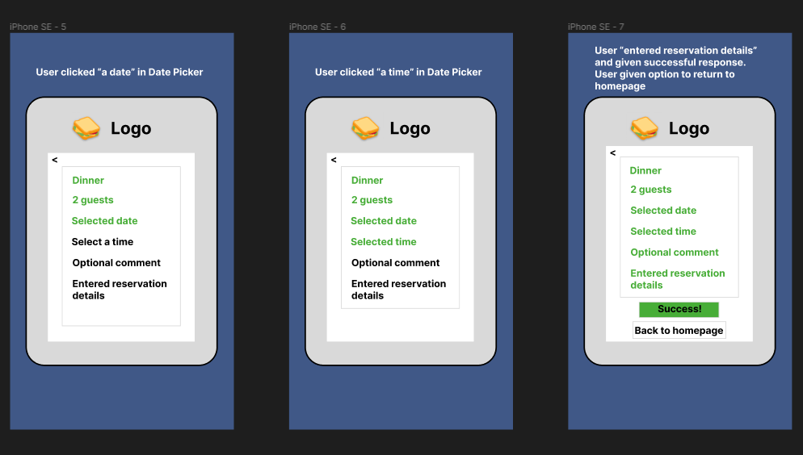
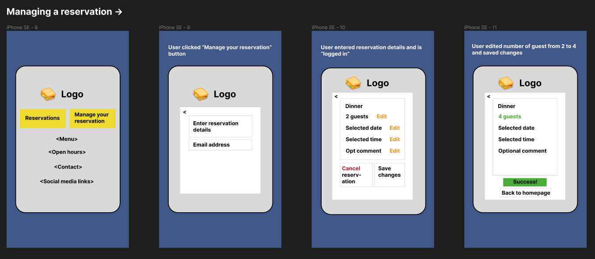

## Style and colors
I gathered inspiration from existing restaurant businesses I personally enjoy. The style I was aiming for in the end would be a simple but elegant impression and I wanted it to be a theme throughout the entire website. I imagined a one-page site with almost all content conveniently gathered in a collected space for the user to easily find by scrolling up or down. I kept it simple by using one image placed in the background and one font for all views of the web application. 

- Background image
    - The background image is meant to portray a photograph taken of part of the 'dining room' of the restaurant. I chose this image because it had pleasant colors and a wide scope of what it contained. The image rhymed with the project theme while also targeting to attract the imagined guest/user. 
- Font
    - The font used in this project is Cutive Mono 400 from [Google Fonts](https://fonts.google.com/). I chose this font as it followed the theme nicely by lending its simple yet elegant aesthetic. 
- Colors
    - When choosing the colors, I wanted to continue to keep it simple but pleasant, visible and accessible. It was important to choose colors that would go well with the background image and contrast eachother, while still being easy on the eyes. 
    - Main colors used:
        - White - #ffffff
        - Dark grey - rgba(20, 20, 20, 0.7);
        - Very dark grey - #1f1f1f
        - Gold - #d8b352
        - Burgundy red - #752525

# Database Model
This project was built with the Django Framework. Django is a Python based framework designed to create web applications, and it encourages rapid development. Django is based on Model-View-Template (MVT) architecture. MVT is a software design pattern for developing a web application. It consists of the following three entities:

- The **Model** manages the data and is represented by a database. A model is basically a database table.
- The **View** receives HTTP requests and sends HTTP responses. A view interacts with a model and template to complete a response.
- The **Template** is basically the front-end layer and the dynamic HTML component of a Django application.

## ERD

During the planning stage of this project, I also sketched an ERD (Entity Relationship Diagram) of my database model, using the diagram tool Lucidchart. Creating a visual diagram of the database model helped me gain a clearer understanding of what my model would be able to contain, based on the user stories of this project. 

# Features
In this section there is a description of each feature the user would experience while visiting this projects site. 

## Existing Features
- Navigation
    - At the top of every view, the user is presented with a navbar. The navbar contains the restaurants logo, which is always clickable, allowing a user to return to the front page at any time. There is a login/out button located in the navbar, allowing the user to login/out whenever they with. The button switches from *Login* to *Logout* depending on if the user is logged in or out. Adjacent to the button, there is also a space signaling if a user is logged in or not and with which account. On smaller screens the login/out button and signal collapse under a hamburger menu.

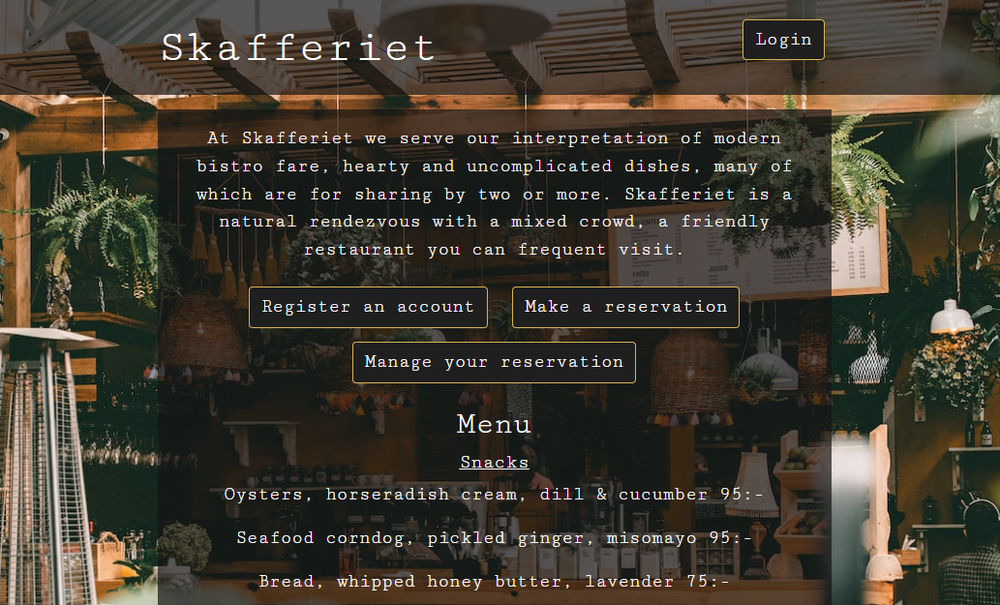

- Home page
    - Below the navbar, the user will find the content of the home page. A short welcoming description of the restaurant, followed by three buttons taking them to different directions:
        - Register an account
        - Make a reservation
        - Manage you reservation
    - Below the navigational buttons, the user will find the restaurants current menu, the open hours and contact information. All of which are easily accessed by simply scrolling up and down this one page. 
- Footer
    - In the bottom of every view, the user is presented with a footer containing external icon links to the restaurants social media accounts. 
- Register an account
    - This project features the functionality for user to register an account, so that they can log in to make reservations and also manage them. By clicking the **Register an account** button, the user is taken to a sign up view, displaying information on how to register an account. The user is also presented with a **Back** button, taking them back to the home page. Or if they already have an account, the user can click the **Login** button in the bottom of the page. 
    - Once the user has entered the appropriate details and clicked Sign Up, they have successfully registered and are taken to the **Login** page.

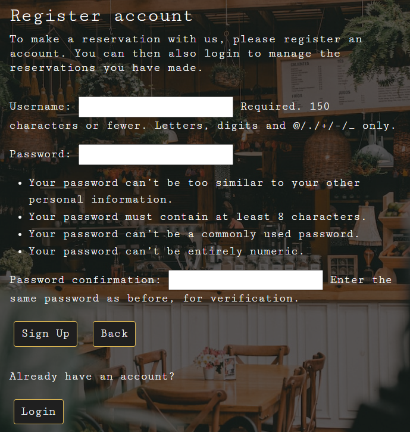

- Make a reservation
    - From the home page, a user can navigation to make a reservation by clicking the **Make a reservation** button. If the user is not logged in, they will be prompted to login to continue. And if the user does not have an account yet, they are presented with a **Register an account** button to register. When the user is logged in, they are presented with a form to fill with the details of their desired reservation: 
        - Guest
        - Day
        - Time
        - First name
        - Last name
        - Email address
    - All fields are required to fill out, otherwise the user will be alerted to fill in the details before being able to continue. 
    - Once all details are entered, they can click the **Save reservation** button to continue. The user also has the option to go back to the home page by clicking the **Back** button. 

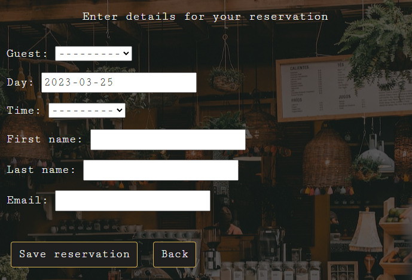

- Confirm reservation
    - When the user has clicked the **Save reservation** button, they are presented with a confirmation view, containing the details of their created reservation. From here, they can either navigate back to the home page or continue to **Edit reservation** by clicking on respective buttons.

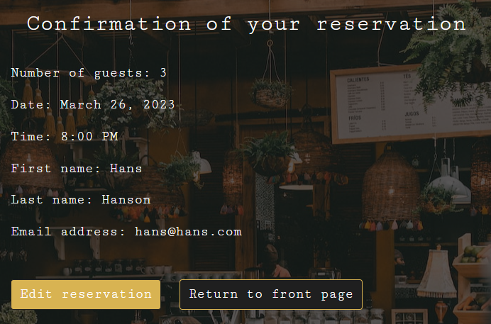

- Manage your reservation
    - The third navigational button on the home page, **Manage your reservation**,  will take a logged in user to a view listing all reservations made by the user. If not logged in, the user will be asked to login before continuing. 
    - From this list view, the user will find each reservation they have made and its details. They have the option to click an **Edit reservation** button provided with each reservation or go back to the home page. 

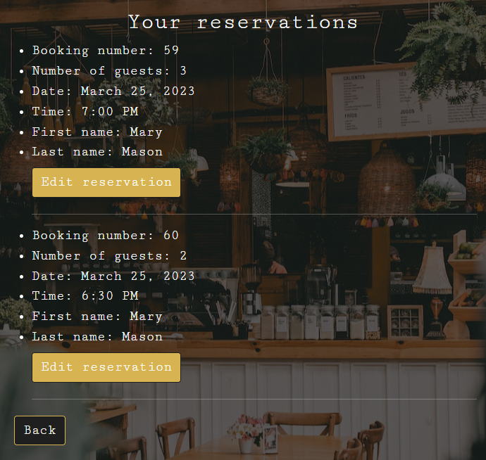

- Edit your reservation page
    - A user having clicked the **Edit reservation** button will be presented with a reservation form, prepopulated with the originally entered details of that specific reservation. The user is free to change the details in all fields and click **Save changes** to update the reservation. Upon saving the updated details of the reservation, the user is taken back to their list of reservations and can now see the details are updated. 
    - While in the **Edit reservation** view, the user also has the option of deleting that reservation or going back to their list of reservations by clicking on respective buttons.

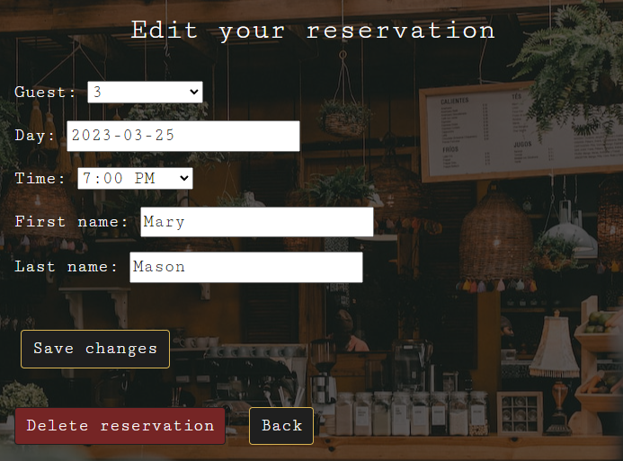

- Delete your reservation page
    - In the **Edit reservation** view, the user can also choose to completely remove their reservation by clicking the **Delete reservation** button. This will take them to a view asking them confirm the deletion of that reservation or go back to their list of reservations by clicking respective buttons. Upon clicking the **Confirm** button, the user is returned to their list of reservations and can now see that the reservation the deleted is no longer in the list of their reservations. 

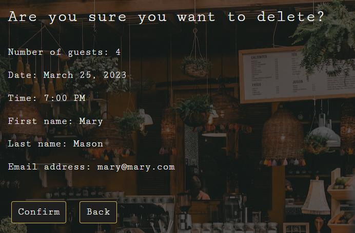

- Login and Logout Page
    - The **Login** page is accessed from the top of the navbar or automatically redirected by being logged out and trying to view pages not accessible unless logged in. Here,  the user can enter their registered account details to login and continue to navigate the sites features. 
    - The login/out status is reflected to the user adjacent to the **Login** button in the top of the navbar. The logged in users username is presented when logged in. 
    - When clicking the **Logout** button in the navbar, the user is presented with a confirming logout message and has the option of either logging in again or returning to the home page by clicking on respective buttons. 

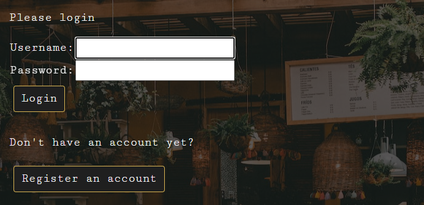

- Admin panel
    - Being the creator of this project I have access to an admin panel, where I can easily access everything stored in the database. This admin panel is a built-in feature in the Django Framework, allowing me many abilities as an admin. The most important use as an admin for this project is to be able to create, read, update and delete guests and reservations, so that I can have the utmost control of this projects website. 
    - As an admin I can view all registered users and their created reservations stored in the database. I manipulate the data of both users accounts and reservations. 

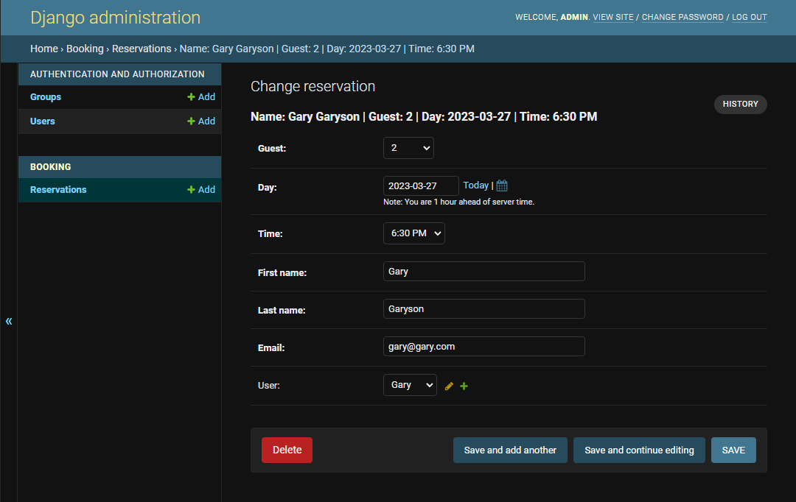

# Technologies Used
## Languages
- HTML
- CSS
- Python
## Frameworks, Libraries and Programs
- [Django](https://www.djangoproject.com/)
    - Django was used to build the models, forms and views of the app, and was the backbone of this project.
- [Bootstrap v5.1](https://getbootstrap.com/docs/5.1/getting-started/introduction/)
    - Bootstrap was used to implement the responsiveness of the site, using bootstrap classes.
- [Cloudinary](https://cloudinary.com/)
    - Cloudinary was used as free cloud storage for the background image.
- [Google Fonts](https://fonts.google.com/)
    - Google fonts were used to import the font "Cutive Mono 400". This font was used throughout the entire project.
- [Font Awesome](https://fontawesome.com/)
    - Font Awesome was used on all pages throughout the website to import icons (social media icons).
- [Git](https://git-scm.com/)
    - Git was used for version control by utilizing the GitPod terminal to commit to Git and push to GitHub.
- [GitHub](https://github.com/)
    - GitHub was used to store the project after pushing.
- [PostgreSQL](https://www.elephantsql.com/) 
    - Deployed project on ElephantSQL uses a PostgreSQL database
- [Figma](https://www.figma.com/)
    - A design tool used to sketch out a wireframe of the websites design. 
- [Lucidchart](https://bit.ly/3nidrjl)
    - A diagram tool used to create a visual sketch of the database model in this project. 
- [Amiresponsive](https://ui.dev/amiresponsive)
    - Am I Responsive was used to see responsive design throughout the process and to generate mockup imagery to be used. 

# Manual Testing
## Bugs

# Deployment
This project was deployed through Heroku using the following steps:
#### **Creating Heroku App**
+ Log into Heroku
+ Select 'Create New App' from your dashboard
+ Choose an app name (if there has been an app made with that name, you will be informed and will need to choose an alternative)
+ Select the appropriate region based on your location
+ Click 'Create App'

**Connecting to GitHub**
+ From the dashboard, click the 'Deploy' tab towards the top of the screen
+ From here, locate 'Deployment Method' and choose 'GitHub'
+ From the search bar newly appeared, locate your repository by name
+ When you have located the correct repository, click 'Connect'

**Environment Variables**
+ Click the 'Settings' tab towards the top of the page
+ Locate the 'Config Vars' and click 'Reveal Config Vars'
+ Add the variables needed
+ Go back to 'Deploy' tab, locate 'Manual deploy' towards the bottom of the page
+ Click 'Deploy Branch' and wait until build finished
+ Locate and click 'Open app' in top of the app dashboard

# Future Improvements

# References
Below are links to references I have used as inspiration or altered for use in my project. They have also been placed appropriately in the code. 
## Code Content
- [Useful tutorial to better understand Django Framework](https://www.youtube.com/playlist?list=PL-osiE80TeTtoQCKZ03TU5fNfx2UY6U4p)
- [Another useful tutorial playlist](https://www.youtube.com/playlist?list=PLOLrQ9Pn6cawJ9CbY-o_kQC4GOWfhCFHq )
- [Django user authentication and permissions](https://developer.mozilla.org/en-US/docs/Learn/Server-side/Django/Authentication)
- [Generic list and detail views](https://developer.mozilla.org/en-US/docs/Learn/Server-side/Django/Generic_views#book_detail_page)
- [Django user sign up tutorial](https://learndjango.com/tutorials/django-signup-tutorial )
- [Appointment code snippet](https://blog.devgenius.io/django-tutorial-on-how-to-create-a-booking-system-for-a-health-clinic-9b1920fc2b78)
- [Adding CreateView](https://www.geeksforgeeks.org/createview-class-based-views-django/)
- [Adding ListView](https://www.geeksforgeeks.org/listview-class-based-views-django/)
- [Adding DetailView](https://www.geeksforgeeks.org/detailview-class-based-views-django/)
- [Adding UpdateView](https://www.geeksforgeeks.org/updateview-class-based-views-django/?ref=rp)
- [Adding DeleteView](https://www.geeksforgeeks.org/deleteview-class-based-views-django/)
- [Python “line too long” fix](https://stackoverflow.com/questions/14143284/line-is-too-long-django-pep8)
- [Remove list bullets](https://www.tutorialspoint.com/How-to-create-an-unordered-list-without-bullets-in-HTML)
## Media
- [Cloudinary Image Hosting](https://cloudinary.com/)
- [Google Fonts – Cutive Mono 400](https://fonts.google.com/)
- [Font Awesome](https://fontawesome.com/)
- [Amiresponsive](https://ui.dev/amiresponsive)
- [Unsplash - Background image](https://unsplash.com/photos/xhKG01FN2uk)
- [Favicon generator](https://realfavicongenerator.net/favicon_result?file_id=p1gs1e33dd9re15vc1k9n3og1ui86#.ZBlQhnbMKUk)
- [Favicon fork and spoon](https://favpng.com/png_view/knife-knife-fork-symbol-spoon-cutlery-png/yPQ2qmw4)
## Design inspiration
- [Lilla Ego](https://www.lillaego.com/)
- [Animo](https://www.animorestaurant.se/)
- [Främmat](https://frammat.com/)
- [Ett Bageri](https://www.ettbageri.se/)
- [Oaxen Slip](https://oaxen.com/en/bistro-oaxen-slip/)
## Design Tools
- [Figma](https://www.figma.com/)
- [Lucidchart](https://bit.ly/3nidrjl)
## Validation Tools
- [Python validator](https://pep8ci.herokuapp.com/)
- [HTML validator](https://validator.w3.org/#validate_by_inpu)
- [CSS validator](https://jigsaw.w3.org/css-validator/)
## Other
- [What is Django?](https://python.plainenglish.io/the-mvt-design-pattern-of-django-8fd47c61f582) (In README.md description)
- [Blog walkthrough LMS]( https://learn.codeinstitute.net/courses/course-v1:CodeInstitute+FST101+2021_T1/courseware/b31493372e764469823578613d11036b/fe4299adcd6743328183aab4e7ec5d13/)
- [README.md on LMS](https://learn.codeinstitute.net/courses/course-v1:CodeInstitute+IDE101+20/courseware/536d98fd22554d0198eb7c94e10b63fb/f19e9eaf1133492c9377344e7bfe0f00/3?activate_block_id=block-v1%3ACodeInstitute%2BIDE101%2B20%2Btype%40html%2Bblock%4095d3a88ee4f244b29a916c3b2315a6ba)
- [Kat632](https://github.com/Kat632/PP4-LettuceEat#Technologies-Used) and [aleksandracodes](https://github.com/aleksandracodes/CI_PP4_Workout_Planner#technologies-used)
    - For structure of Technologies Used in README.md
## Acknowledgements
- Mentors, tutors and students at Code Institute