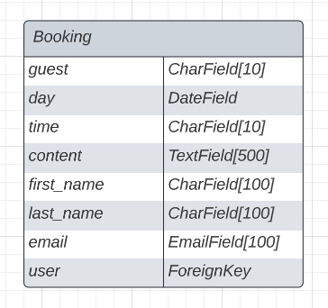

# Skafferiet Restaurant

Skafferiet is a local (not real) restaurant, based in central Stockholm, Sweden. 

*At Skafferiet we serve our interpretation of modern bistro fare, hearty and uncomplicated dishes, many of which are for sharing by two or more. Skafferiet is a natural rendezvous with a mixed crowd, a friendly restaurant you can frequent visit.*

The restaurants website targets curious people seeking to enjoy modern cuisine presented in a fun and simple but elegant manner in an vibrant environment. 

# Table of contents
1. [UX-Design](#ux-design)
    - [Planning](#planning)
        - [Design Thinking](#design-thinking)
        - [User Stories](#user-stories)
        - [Website flow](#website-flow)
    - [Wireframe](#wireframe)
2. [Database Model](#database-model)
    - [ERD](#erd)
3. [Features](#features)
    - [Existing Features](#existing-features)
    - [Future Improvements](#future-improvements)
4. [Technologies](#technologies)
5. [Manual Testing](#manual-testing)
6. [Deployment](#deployment)
7. [References](#references)
    - [Code content](#code-content)
    - [Media](#media)
    - [Acknowledgements](#acknowledgements)

# UX-Design
## Planning
### Design thinking
When I began working on this project I tried to put myself in the users position, trying to imagine what a users wants and needs are in a website for a restaurant. 

I first posed two important questions imagined being answered by both a user of the website and guest of the restaurant: 
- Why would a user want to visit our restaurants website?
    - *To discover the restaurant, view the menu, book a reservation, find contact and opening hours information.*
- What will make them return?
    - *A pleasant experience of both the physical restaurant and websites pleasant UX (i.e. clear navigation, easy to book/manage reservation).*

Examining the answers of these questions, I could follow up with a final question, also imagined being answered by a user: 
- What do I want to see when I visit a restaurants website?
    - *Restaurant name, contact info, opening hours, booking functionality and menu.*

By posing these three important questions, I could now base my user stories on the answers.

### User stories
Below are the user stories in their epics created for this project. 

As a site user: 

- Navigation
    - View site navigation:
        - As a **Site user** I can **view options to make a new reservation or manage an existing reservation** so that **I can choose where to navigate to on the website** 
- Create a reservation
    - Create reservation: 
        - As a **logged in Site user** I can **create a reservation** so that **I have a reserved time and date at the restaurant** 
    - Party number: 
        - As a **Site user** I can **view the options for the number of people to reserve for** so that **I can select the amount of people in my party**
    - Enter date:
        - As a **Site user** I can **enter a date** so that **I can select which date to make a reservation** 
    - Available times:
        - As a **Site user** I can **view a list of available times on available dates** so that **I can select what time to make a reservation** 
    - Add comment:
        - As a **Site user** I can **add a comment to my reservation** so that **I can communicate anything specific in my reservation** 
    - Add name and email:
        - As a **Site user** I can **register a first name, last name and an email address** so that **I can make a reservation** 
- Authentication and managing a reservation 
    - Register account:
        - As a **Site user** I can **register an account** so that **I can create a reservation**
    - View reservations: 
        - As a **logged in Site user** I can **view a list of my reservations** so that **I can decide which reservation to manage** 
    - Manage reservation:
        - As a **Site user** I can **enter user details** so that **I can create a reservation or read, update or delete my existing reservation** 
- Additional information
    - View menu:
        - As a **Site user** I can **view the restaurant’s menu** so that **I know what they are currently offering
    - View contact information:
        - As a **Site user** I can **view contact information and the opening hours** so that **I know where the restaurant is and when it is open**
    - View social media:
        - As a **Site user** I can **view social media links** so that **I can open external links to the restaurant’s social media accounts**

As a site admin: 
- Authentication and managing a reservation
    - Manage guest reservation:
        - As a **Site admin** I can **create, read, update and delete guest reservations** so that **I can manage guest reservations** 

### Website flow
With the user stories in place I could begin to imagine how a user would interpret the flow of the website: 

-	User visits website
    - User is presented with a one-page website containing:
        - Logo
        - **Reservation button**
        - **Manage your reservation button**
        - Menu 
        - Open hours
        - Contact info
        - Social media links
        - A relevant image/color/something in the background

-	The **Reservation button** takes the user to a page with a booking system where they are presented with entry fields to fill:
    - An experience (dinner) 
    - Guest number
    - Date
    - Time
    - (Optional message)
        - After choosing Experience/Guest/Date/Time, user is required to enter name, last name, email address
-	The **Manage your reservation button** takes the user to a page with where they are asked to enter user details. The user enters their details and they are presented with the options to edit their booking. 

## Wireframe
Before building, when planning this website I used the design tool Figma, to create a wireframe of the project. It allowed me to make a basic sketch of what I wanted the the website to look like, what features to include and where to place them. This proved to be very useful as I could base my decisions on the already sketched out wireframe when building the website.

# Database Model
This project was built with the Django Framework. Django is a Python based framework designed to create web applications, and it encourages rapid development. Django is based on Model-View-Template (MVT) architecture. MVT is a software design pattern for developing a web application. It consists of the following three entities:

- The **Model** manages the data and is represented by a database. A model is basically a database table.
- The **View** receives HTTP requests and sends HTTP responses. A view interacts with a model and template to complete a response.
- The **Template** is basically the front-end layer and the dynamic HTML component of a Django application.

## ERD

During the planning stage of this project, I also sketched an ERD (Entity Relationship Diagram) of my database model, using the diagram tool Lucidchart. Creating a visual diagram of the database model helped me gain a clearer understanding of what my model would be able to contain, based on the user stories of this project. 

# Features
# Technologies
# Manual Testing
# Deployment
# References